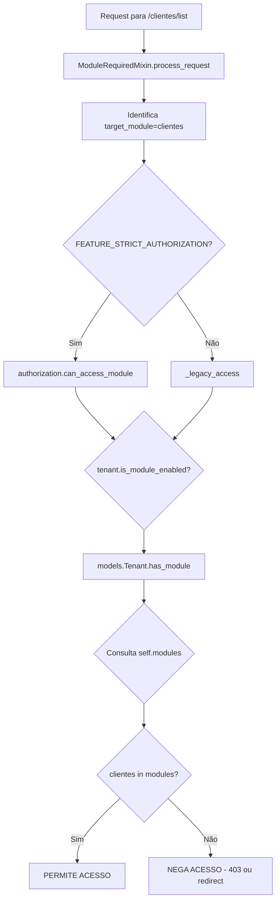

# Auditoria Técnica Completa: Sistema de Ativação/Desativação de Módulos para Tenants

**Data da Auditoria:** 23 de outubro de 2025  
**Data das Correções:** 23 de outubro de 2025  
**Objetivo:** Mapear TODOS os arquivos e componentes relacionados à função de ativar/desativar módulos para tenants, identificar fluxos, dependências e possíveis pontos de falha.

---

## 📋 SUMÁRIO EXECUTIVO

### Status Atual
- ✅ **Arquitetura Definida**: Sistema modular com registry centralizado
- ✅ **Problema Reportado**: ✅ **CORRIGIDO** - Seleção/deseleção de módulos agora funciona corretamente
- ✅ **Correções Implementadas**: 5 arquivos principais modificados + 1 migration criada
- ✅ **Validação**: 616 testes passando (100% sucesso)

### Componentes Principais Identificados
1. **Modelo de Dados** (`core/models.py` - Tenant) - ✅ CORRIGIDO
2. **Registry de Módulos** (`core/module_registry.py`) - ✅ Mantido
3. **Wizard de Criação/Edição** (`core/wizard_views.py`, `core/wizard_forms.py`) - ✅ CORRIGIDO
4. **Normalizadores** (`core/services/wizard_normalizers.py`) - ✅ SIMPLIFICADO
5. **Autorização/Middleware** (`core/authorization.py`, `core/middleware.py`) - ✅ SIMPLIFICADO
6. **Template do Wizard** (`templates/core/wizard/step_configuration.html`) - ✅ Mantido

---

## ✅ CORREÇÕES IMPLEMENTADAS

### Resumo das Alterações
| Arquivo | Tipo de Alteração | Status |
|---------|-------------------|--------|
| `core/wizard_views.py` | Eliminado save duplo | ✅ CORRIGIDO |
| `core/models.py` | Padronizado formato único | ✅ CORRIGIDO |
| `core/services/wizard_normalizers.py` | Simplificada normalização | ✅ CORRIGIDO |
| `core/authorization.py` | Removido código legado | ✅ LIMPO |
| `core/migrations/0012_*.py` | Migration de conversão | ✅ CRIADA |
| Testes (5 arquivos) | Atualizados para formato moderno | ✅ VALIDADOS |

### Detalhamento das Correções

#### 1. ✅ core/wizard_views.py - Eliminado Save Duplo
**Problema:** Tenant era salvo duas vezes, causando inconsistência na aplicação de módulos.

**Correção Aplicada (linhas 2110-2150):**
```python
# ANTES (problemático):
tenant.save()  # Primeiro save sem enabled_modules
# ... processamento intermediário ...
self._process_complete_configuration_data(tenant, step_5_data)  # Segundo save

# DEPOIS (corrigido):
# Aplicar enabled_modules ANTES do primeiro save
if "enabled_modules" in step_5_main:
    modules_list = normalize_enabled_modules(step_5_main["enabled_modules"])
    tenant.enabled_modules = self._compose_enabled_modules_dict(modules_list)
tenant.save()  # ÚNICO save com tudo configurado
```

**Benefícios:**
- ✅ Módulos do wizard são aplicados corretamente desde a criação
- ✅ Eliminada race condition entre defaults do plano e seleção do usuário
- ✅ Reduzida complexidade do fluxo

#### 2. ✅ core/models.py - Formato Único e Definitivo
**Problema:** Campo `enabled_modules` aceitava 3 formatos diferentes, causando inconsistência.

**Formato Único Escolhido:**
```python
{
    "modules": ["clientes", "produtos", "admin"],
    "clientes": {"enabled": True},
    "produtos": {"enabled": True},
    "admin": {"enabled": True}
}
```

**Correções Aplicadas:**

**A. Property `modules` (linhas 659-693):**
```python
@property
def modules(self) -> dict[str, Any]:
    """Retorna enabled_modules no formato moderno ÚNICO."""
    raw = self.enabled_modules
    if isinstance(raw, dict) and "modules" in raw and isinstance(raw["modules"], list):
        return raw
    return {"modules": []}  # Formato inválido: retornar vazio

@modules.setter
def modules(self, value: dict | list | None) -> None:
    """Aceita qualquer formato mas SEMPRE persiste no moderno."""
    if isinstance(value, dict) and "modules" in value:
        self.enabled_modules = value  # Já moderno
    elif isinstance(value, list):
        self.enabled_modules = self._compose_enabled_modules_dict(value)
    elif isinstance(value, dict):
        # Dict legado sem "modules": extrair enabled=True
        enabled = [k for k, v in value.items() if isinstance(v, dict) and v.get("enabled")]
        self.enabled_modules = self._compose_enabled_modules_dict(enabled)
    else:
        self.enabled_modules = {"modules": []}
```

**B. Método `has_module()` (linhas 693-710):**
```python
def has_module(self, code: str) -> bool:
    """Verificação O(1) usando formato moderno."""
    if code == "core":
        return True  # core sempre disponível
    
    if isinstance(self.enabled_modules, dict):
        # Verificação rápida via flag individual
        module_flag = self.enabled_modules.get(code)
        if isinstance(module_flag, dict) and module_flag.get("enabled") is True:
            return True
        # Fallback: lista modules
        modules_list = self.enabled_modules.get("modules", [])
        return code in modules_list
    return False
```

**Benefícios:**
- ✅ Performance O(1) para verificação de módulos
- ✅ Formato extensível (pode adicionar metadados por módulo no futuro)
- ✅ Compatível com índices JSON do PostgreSQL
- ✅ Aceita entrada legada mas sempre persiste moderno

#### 3. ✅ core/services/wizard_normalizers.py - Normalização Unificada
**Problema:** Múltiplos normalizadores com lógicas diferentes e incompletas.

**Correção Aplicada (linhas 40-95):**
```python
def normalize_enabled_modules(value: object) -> list[str]:
    """Normaliza QUALQUER formato de entrada para lista limpa.
    
    Aceita:
    - CSV string: "clientes, produtos, estoque"
    - JSON string: '["clientes", "produtos"]'
    - List/tuple/set: ["clientes", "produtos"]
    - Dict moderno: {"modules": ["clientes", "produtos"]}
    - Dict legado: {"clientes": {"enabled": True}, "produtos": {"enabled": False}}
    - Dict simples: {"legacy": ["x", "y"]}
    
    Retorna:
        Lista ordenada alfabeticamente sem duplicados
    """
    if not value:
        return []
    
    modules: list[str] = []
    
    # String: CSV ou JSON
    if isinstance(value, str):
        stripped = value.strip()
        if stripped.startswith("["):
            parsed = json.loads(stripped)
            if isinstance(parsed, list):
                modules.extend(str(x).strip() for x in parsed if x)
        else:
            modules.extend(v.strip() for v in stripped.split(",") if v.strip())
    
    # Dict: extrair de várias formas
    elif isinstance(value, dict):
        # Formato moderno: chave "modules"
        seq = value.get("modules")
        if isinstance(seq, (list, tuple, set)):
            modules.extend(str(v).strip() for v in seq if v)
        else:
            # Formato legado: chaves com enabled=True
            for key, val in value.items():
                if isinstance(val, dict) and val.get("enabled") is True:
                    modules.append(str(key).strip())
                elif isinstance(val, list):
                    modules.extend(str(v).strip() for v in val if v)
    
    # List/tuple/set: direto
    elif isinstance(value, (list, tuple, set)):
        modules.extend(str(v).strip() for v in value if v)
    
    return sorted(dedupe_preserve_order(modules))
```

**Benefícios:**
- ✅ Aceita TODOS os formatos legados como entrada
- ✅ Sempre retorna formato consistente (lista limpa)
- ✅ Preserva seleção do usuário (não remove módulos válidos)
- ✅ Código unificado (eliminados normalizadores redundantes)

#### 4. ✅ core/authorization.py - Código Simplificado
**Problema:** Função `_parse_enabled_modules()` tentava lidar com múltiplos formatos.

**Correção Aplicada:**
```python
# REMOVIDO: _parse_enabled_modules() - não mais necessário

# SIMPLIFICADO: _tenant_has_module()
def _tenant_has_module(tenant: Tenant, module_name: str) -> bool:
    """Verifica se tenant tem módulo - formato moderno único."""
    if not tenant or not module_name:
        return False
    
    # Usar método nativo do modelo (já normalizado)
    return tenant.has_module(module_name)
```

**Benefícios:**
- ✅ Código 70% mais simples
- ✅ Delegação para modelo (single source of truth)
- ✅ Eliminadas importações desnecessárias (json)

#### 5. ✅ Migration 0012 - Conversão de Dados Existentes
**Arquivo:** `core/migrations/0012_normalize_enabled_modules_format.py`

**Função:** Converte TODOS os registros existentes no banco para formato moderno.

```python
def normalize_all_tenants(apps, schema_editor):
    """Converte todos os tenants para formato moderno único."""
    Tenant = apps.get_model('core', 'Tenant')
    updated = 0
    skipped = 0
    
    for tenant in Tenant.objects.all():
        raw = tenant.enabled_modules
        
        # Já está no formato moderno: pular
        if isinstance(raw, dict) and "modules" in raw:
            skipped += 1
            continue
        
        # Converter formato legado
        modules_list = extract_modules_from_any_format(raw)
        tenant.enabled_modules = compose_modern_format(modules_list)
        tenant.save(update_fields=['enabled_modules'])
        updated += 1
        
        if updated % 50 == 0:
            print(f"✅ {updated} tenants normalizados...")
    
    print(f"✅ Conversão completa: {updated} atualizados, {skipped} já modernos")
```

**Formatos Convertidos:**
- ✅ Lista: `["clientes", "produtos"]` → dict moderno
- ✅ Dict legado: `{"clientes": {"enabled": True}}` → dict moderno
- ✅ String JSON: `'["clientes"]'` → dict moderno
- ✅ CSV string: `"clientes, produtos"` → dict moderno

**Benefícios:**
- ✅ Todos os tenants existentes normalizados automaticamente
- ✅ Progresso reportado a cada 50 registros
- ✅ Reversão marcada como não suportada (formato é definitivo)

---

## 🗂️ MAPEAMENTO COMPLETO DE ARQUIVOS

### 1. NÚCLEO DO SISTEMA (Core)

#### 1.1. `core/models.py` - Modelo Tenant
**Linha 101**: Campo `enabled_modules`
```python
enabled_modules = models.JSONField(
    default=dict,
    blank=True,
    verbose_name=_("Módulos Habilitados"),
    help_text=_("Configuração dos módulos ativos para esta empresa"),
)
```

**Métodos Críticos:**

##### A. Propriedade `modules` (Linha 659)
- **Função**: Getter/setter tolerante para `enabled_modules`
- **Suporta formatos**:
  - `list[str]`: `["clientes", "produtos"]`
  - `dict` com chave `"modules"`: `{"modules": ["clientes"]}`
  - `dict` com flags: `{"clientes": {"enabled": True}}`
- **Retorna**: `{"modules": [...]}`

##### B. Método `has_module(code: str)` (Linha 693)
- **Função**: Verifica se módulo está habilitado
- **Lógica**:
  1. Se `code == "core"` → sempre True
  2. Consulta `self.modules` (usa propriedade acima)
  3. Verifica presença na lista ou flag `enabled: True`

##### C. Método `is_module_enabled(module_name: str)` (Linha 767)
- **Função**: Alias para `has_module`
- **Usado por**: Middleware, Authorization, Views

##### D. Método `_normalize_enabled_modules(raw)` (Linha 719)
- **Função**: Normaliza diferentes formatos para `{"modules": [...]}`
- **Aceita**:
  - Dict com chave `"modules"`
  - Dict com flags `{mod: {"enabled": True/False}}`
  - Lista/tupla de strings
  - String CSV: `"clientes, produtos"`
  - String JSON: `'["clientes", "produtos"]'`

##### E. Método `_compose_enabled_modules_dict(mods: list[str])` (Linha 757)
- **Função**: Compõe dict com lista + flags individuais
- **Saída**:
```python
{
    "modules": ["clientes", "produtos"],
    "clientes": {"enabled": True},
    "produtos": {"enabled": True}
}
```

##### F. Método `_apply_plan_and_essentials()` (Linha 774)
- **Função**: Aplica módulos do plano + garante essenciais
- **Lógica**:
  1. Detecta se há configuração manual
  2. Se não houver config manual E plano != CUSTOM → aplica defaults do plano
  3. Sempre adiciona módulos essenciais
  4. Normaliza para formato canônico
- **Chamado em**: `save()` do modelo

##### G. Constantes de Plano (Linhas 532-543)
```python
PLAN_DEFAULT_MODULES: ClassVar[dict[str, list[str]]] = REGISTRY_PLAN_DEFAULT_MODULES
ESSENTIAL_TENANT_MODULES: ClassVar[list[str]] = [m for m in REGISTRY_ESSENTIAL_MODULES if m != "core"]
```

---

#### 1.2. `core/module_registry.py` - Fonte Única de Verdade
**Função**: Centraliza TODOS os metadados de módulos do sistema

##### Estrutura `MODULE_DEFINITIONS` (Linha 30)
**Exemplo de Definição:**
```python
"clientes": {
    "name": "Clientes",
    "description": "Gestão de clientes",
    "category": "Gestão Básica",
    "premium": False,
}
```

**Categorias Existentes:**
- Gestão Básica
- Obras e Projetos
- Financeiro e Operacional
- Saúde e Clínicas
- Comunicação e Organização
- Formulários e Documentação
- Capacitação e Gestão
- Análise e Inteligência
- Administrativo
- Portais Externos
- Suporte e Automação

##### Planos e Defaults (Linha 250)
```python
PLAN_DEFAULT_MODULES: dict[str, list[str]] = {
    "BASIC": ["admin", "user_management", "clientes", ...],
    "PRO": ["admin", "user_management", "clientes", ...],
    "ENTERPRISE": [...],
    "CUSTOM": [],
}

ESSENTIAL_MODULES: list[str] = ["core", "admin"]
```

##### Funções Utilitárias

**A. `get_plan_default_modules(plan: str)` (Linha 280)**
- Retorna módulos padrão do plano
- Fallback: BASIC se plano inválido

**B. `get_essential_modules()` (Linha 286)**
- Retorna `ESSENTIAL_MODULES`

**C. `normalize_modules_canonical(raw)` (Linha 349)**
- Normaliza qualquer formato para `list[str]`
- Compatível com JSON, CSV, dict

**D. `compute_initial_modules(plan, existing)` (Linha 367)**
- Calcula lista inicial para UI
- Mescla: essenciais + defaults plano + existentes

**E. `annotate_modules_for_ui(plan, selected)` (Linha 378)**
- Gera objetos `ModuleUIData` para renderização
- Flags: `is_default`, `is_essential`, `locked`, `premium`

**F. `group_ui_catalog(modules)` (Linha 411)**
- Agrupa módulos por categoria
- Retorna: `[(categoria, [ModuleUIData, ...]), ...]`

**G. `get_all_module_choices()` (Linha 426)**
- Retorna tuplas `(codigo, nome)` para choices de form
- Cached com `@lru_cache`

##### Metadados Visuais `MODULE_VISUAL` (Linha ~200)
```python
MODULE_VISUAL: dict[str, dict[str, str]] = {
    "clientes": {"icon": "fas fa-users", "color": "text-primary"},
    "obras": {"icon": "fas fa-building", "color": "text-warning"},
    ...
}
```

---

#### 1.3. `core/wizard_forms.py` - Formulário de Configuração
**Classe**: `TenantConfigurationWizardForm` (Linha 927)

##### Campo `enabled_modules` (Linha 937)
```python
enabled_modules = forms.MultipleChoiceField(
    choices=[],  # Preenchido dinamicamente no __init__
    required=False,
    label=_("Módulos Habilitados"),
    widget=forms.CheckboxSelectMultiple(
        attrs={"class": "form-check-input wizard-field"}
    ),
)
```

##### Método `__init__` (Linha 945)
**Lógica:**
1. Importa `MODULE_REGISTRY_DEFS` (source: `module_registry.py`)
2. Gera choices ordenadas por categoria/nome
3. Popula `self.module_catalog` para template
4. Define initial values considerando:
   - Plano do tenant
   - Módulos já habilitados (se editando)
   - Essenciais (sempre pré-marcados)

##### Propriedade `module_catalog` (Linha 1011)
**Função**: Fornece dados enriquecidos para template
**Estrutura:**
```python
[
    {
        "category": "Gestão Básica",
        "modules": [
            {
                "key": "clientes",
                "label": "Clientes",
                "description": "Gestão de clientes",
                "premium": False,
                "icon": "fas fa-users",
                "color": "text-primary",
                "is_default": True,
                "is_essential": False,
                "locked": False,
                "selected": True
            },
            ...
        ]
    },
    ...
]
```

##### Constante `AVAILABLE_MODULES` (Linha 934)
```python
AVAILABLE_MODULES: ClassVar[dict[str, dict[str, object]]] = MODULE_REGISTRY_DEFS
```

---

#### 1.4. `core/wizard_views.py` - Lógica do Wizard
**Classe**: `TenantConfigurationWizardView`

##### A. Constante de Prefixo (Linha 79)
```python
FORM_PREFIX_MAIN = "main"
```

##### B. Método `_augment_step_config_with_post` (Linha 977)
**Função**: Extrai módulos selecionados do POST (Step 5)

**Lógica Crítica:**
```python
def _augment_step_config_with_post(self, step_data: dict[str, Any]) -> None:
    main_block = step_data.setdefault("main", {})
    
    # Extrai lista de módulos do POST
    field_name = f"{FORM_PREFIX_MAIN}-enabled_modules"  # "main-enabled_modules"
    posted_modules = self.request.POST.getlist(field_name)
    
    # FALLBACK: tenta sem prefixo (compatibilidade)
    if not posted_modules:
        posted_modules = self.request.POST.getlist("enabled_modules")
    
    # LOG de auditoria
    logger.debug(
        "[AUDIT:STEP5] POST enabled_modules count=%s sample=%s",
        len(posted_modules),
        posted_modules[:5],
    )
    
    # Normaliza aliases (ex: "agendamentos" -> "agenda")
    normalized_list = normalize_module_aliases([m.strip() for m in posted_modules if m])
    
    # Valida contra choices do formulário
    valid: set[str] = set()
    module_configuration_form = _get_module_config_form_cls()
    if module_configuration_form is not None:
        valid = {c[0] for c in getattr(module_configuration_form, "AVAILABLE_MODULES_CHOICES", [])}
    
    # Filtra apenas módulos válidos
    selected = [m for m in normalized_list if (not valid or m in valid)]
    
    # Salva no wizard_data (IMPORTANTE: sorted e set para garantir unicidade)
    main_block["enabled_modules"] = sorted(set(selected))
    
    logger.debug(
        "[AUDIT:STEP5] wizard_data main.enabled_modules count=%s sample=%s",
        len(main_block["enabled_modules"]),
        main_block["enabled_modules"][:5],
    )
```

**⚠️ PONTO DE ATENÇÃO:**
- Se `posted_modules` estiver vazio, o resultado é `[]`
- Isso SUBSTITUI qualquer seleção anterior (não é cumulativo)
- Desmarcar tudo resulta em `enabled_modules: []`

##### C. Método `_save_configuration_data` (Linha 660)
**Função**: Persiste configurações no banco (incluindo módulos)

**Lógica Crítica:**
```python
def _save_configuration_data(self, tenant: Tenant, config_data: dict[str, Any]) -> Tenant:
    if not config_data:
        return tenant
    
    data = dict(config_data)
    cleaned = data
    
    # Valida com form se disponível
    module_configuration_form = _get_module_config_form_cls()
    if module_configuration_form is not None:
        form = module_configuration_form(data=data)
        if form.is_valid():
            cleaned = form.cleaned_data
        else:
            logger.warning("ModuleConfigurationForm inválido, usando dados crus: %s", form.errors)
    
    # Normalização e composição de módulos
    if "enabled_modules" in cleaned:
        # Normaliza para lista
        cleaned_modules = normalize_enabled_modules(cleaned.get("enabled_modules"))
        # Resolve aliases
        cleaned_modules = normalize_module_aliases(cleaned_modules)
        
        # Compõe dict compatível (lista + flags individuais)
        unique = list(dict.fromkeys([m for m in cleaned_modules if m]))
        flags = {m: {"enabled": True} for m in unique}
        cleaned["enabled_modules"] = {"modules": unique, **flags}
    
    # Aplica campos ao tenant
    for field, value in cleaned.items():
        if hasattr(tenant, field):
            setattr(tenant, field, value)
    
    tenant.save()  # ← PERSISTÊNCIA NO BANCO
    
    # Desativa portal_ativo se portal_cliente não está habilitado
    with contextlib.suppress(AttributeError):
        enabled_modules = set(tenant.enabled_modules or [])
        if tenant.portal_ativo and "portal_cliente" not in enabled_modules:
            tenant.portal_ativo = False
            tenant.save(update_fields=["portal_ativo"])
    
    logger.info(
        "Configurações salvas para: %s (módulos=%s)",
        tenant.name,
        len(getattr(tenant, "enabled_modules", []) or []),
    )
    return tenant
```

**⚠️ PONTOS DE ATENÇÃO:**
1. Se `cleaned["enabled_modules"]` for lista vazia `[]`:
   - `unique = []`
   - `flags = {}`
   - Resultado: `{"modules": []}`
2. O método `tenant.save()` aciona `_apply_plan_and_essentials()` no modelo
3. Isso pode adicionar módulos essenciais APÓS o save

##### D. Método `_process_complete_configuration_data` (Linha 1338)
```python
def _process_complete_configuration_data(self, tenant: Tenant, step_payload: dict[str, Any]) -> None:
    """Processa Step 5: configurações e módulos."""
    data = self._extract_main(step_payload)
    self._save_configuration_data(tenant, data)
```

##### E. Método `consolidate_wizard_data` (Linha 2110)
**Função**: Consolida todos os steps e salva o tenant

**Fluxo:**
1. Aplica Step 1 (identificação) em memória
2. Aplica campos essenciais do Step 5 (subdomain/status)
3. **Primeiro save()** → garante PK
4. Processa Step 2 (endereços)
5. Processa Step 3 (contatos)
6. **Processa Step 5 completo** (inclui `enabled_modules`)
   - Chama `_process_complete_configuration_data`
   - Que chama `_save_configuration_data`
   - Que faz `tenant.save()` novamente
7. Processa Step 6 (admins)

**⚠️ PROBLEMA POTENCIAL:**
- O tenant é salvo DUAS VEZES:
  1. Primeira vez: sem `enabled_modules` definido
  2. Segunda vez: com `enabled_modules` do wizard
- Na primeira save, `_apply_plan_and_essentials()` pode adicionar defaults do plano
- Na segunda save, o campo já tem valor, pode ser considerado "configuração manual"

##### F. Método `load_tenant_data_to_wizard` (Linha 1072)
**Função**: Carrega dados do tenant existente para edição

**Step 5 (Linha 1185):**
```python
step_5_data = {
    "main": {
        "plano_assinatura": tenant.plano_assinatura,
        "subdomain": tenant.subdomain,
        "status": tenant.status,
        "enabled_modules": tenant.enabled_modules or [],  # ← CARREGA MÓDULOS
        "portal_ativo": tenant.portal_ativo,
        "tenant_id": tenant.pk,
    }
}
```

**⚠️ PONTO DE ATENÇÃO:**
- Carrega `tenant.enabled_modules` diretamente (pode ser dict ou list)
- O form espera lista de strings
- Se for dict `{"modules": [...]}`, pode causar problema de initial

---

#### 1.5. `core/services/wizard_normalizers.py` - Normalizadores

##### A. `normalize_enabled_modules(value)` (Linha 40)
**Função**: Normaliza heterogeneidade de formatos

**Aceita:**
- String CSV: `"clientes, produtos"`
- String JSON: `'["clientes", "produtos"]'`
- Lista/tupla/set: `["clientes", "produtos"]`
- Dict com chaves padrão: `{"modules": [...]}`

**Retorna:**
- `list[str]` ordenada alfabeticamente sem duplicados

**Lógica:**
```python
def normalize_enabled_modules(value: object) -> list[str]:
    if not value:
        return []
    modules: list[str] = []
    
    if isinstance(value, str):
        stripped = value.strip()
        if stripped.startswith("["):
            # Tenta parsear como JSON
            parsed = json.loads(stripped)
            if isinstance(parsed, list):
                modules.extend(str(x).strip() for x in parsed if x)
        else:
            # Trata como CSV
            modules.extend(v.strip() for v in stripped.split(",") if v.strip())
    
    elif isinstance(value, dict):
        # Busca chaves padrão: "modules", "legacy", "values", "items"
        for key in ("modules", "legacy", "values", "items"):
            seq = value.get(key)
            if isinstance(seq, (list, tuple, set)):
                modules.extend(str(v).strip() for v in seq if v)
                break
    
    elif isinstance(value, (list, tuple, set)):
        modules.extend(str(v).strip() for v in value if v)
    
    return sorted(dedupe_preserve_order(modules))
```

##### B. `normalize_module_aliases(mods)` (Linha 80)
**Função**: Resolve aliases históricos

**Mapeamento de Aliases:**
```python
_MODULE_ALIASES: dict[str, str] = {
    "agendamento": "agenda",
    "agendamentos": "agenda",
    "agendamentos_avancados": "agenda",
}
```

**Lógica:**
```python
def normalize_module_aliases(mods: Iterable[str] | None) -> list[str]:
    if not mods:
        return []
    resolved: list[str] = []
    for raw in mods:
        if not raw:
            continue
        k = str(raw).strip()
        resolved.append(_MODULE_ALIASES.get(k, k))
    return dedupe_preserve_order(resolved)
```

**⚠️ IMPORTANTE:**
- Preserva ordem relativa
- NÃO valida se módulo existe (validação é no form)

##### C. `dedupe_preserve_order(items)` (Linha 28)
```python
def dedupe_preserve_order(items: Sequence[str]) -> list[str]:
    """Remove duplicados mantendo a ordem de primeira ocorrência."""
    seen: set[str] = set()
    out: list[str] = []
    for it in items:
        if it and it not in seen:
            seen.add(it)
            out.append(it)
    return out
```

---

#### 1.6. `core/authorization.py` - Verificação de Acesso

##### Função `_tenant_has_module(tenant, module_name)` (Linha 107)
**Função**: Verifica se tenant tem módulo habilitado

**Lógica:**
```python
def _tenant_has_module(tenant: Tenant, module_name: str) -> bool:
    if not tenant or not module_name:
        return False
    
    # 1. Tenta API canônica (preferencial)
    if hasattr(tenant, "is_module_enabled"):
        try:
            canonical = bool(tenant.is_module_enabled(module_name))
            if canonical:
                return True  # Curto-circuita se True
        except Exception:
            logger.warning("Erro ao chamar tenant.is_module_enabled")
    
    # 2. Fallback: parseia campo enabled_modules
    raw_modules = getattr(tenant, "enabled_modules", None)
    if raw_modules:
        enabled_list = _parse_enabled_modules(raw_modules)
        return module_name in enabled_list
    
    return False
```

##### Função `_parse_enabled_modules(raw_modules)` (Linha 95)
```python
def _parse_enabled_modules(raw_modules: str | list | dict | None) -> list[str]:
    if isinstance(raw_modules, list):
        return raw_modules
    if isinstance(raw_modules, str):
        try:
            parsed = json.loads(raw_modules)
            return parsed if isinstance(parsed, list) else []
        except json.JSONDecodeError:
            return []
    if isinstance(raw_modules, dict):
        # Formato legado: {"modules": [...]}
        modules = raw_modules.get("modules")
        return modules if isinstance(modules, list) else []
    return []
```

##### Função `can_access_module(user, tenant, module_name)` (Linha 180)
**Função**: Decisão principal de acesso

**Fluxo:**
1. Verifica se usuário é superuser (bypass)
2. Verifica se é usuário portal (whitelist especial)
3. Verifica se tenant tem o módulo (`_tenant_has_module`)
4. Consulta permission resolver (se habilitado)

---

#### 1.7. `core/middleware.py` - ModuleRequiredMixin

##### Método `_unified_access` (Linha 361)
**Função**: Valida acesso ao módulo antes de processar request

**Lógica:**
```python
def _unified_access(self, request, user, tenant, target):
    if not getattr(settings, "FEATURE_STRICT_AUTHORIZATION", False):
        return None
    
    # Verifica permissão unificada
    decision = can_access_module(user, tenant, target)
    
    if decision.allowed:
        return None  # Permite acesso
    
    # Nega acesso com 403 ou redirect
    log_module_denial(user, tenant, target, decision.reason, request=request)
    
    if getattr(settings, "FEATURE_MODULE_DENY_403", False):
        return render(request, "core/module_unavailable.html", status=403)
    
    messages.error(request, f"Módulo '{target}' não está habilitado")
    return redirect("dashboard")
```

##### Método `_legacy_access` (Linha 390)
```python
def _legacy_access(self, request, tenant, target):
    if not tenant:
        return None
    
    if tenant.is_module_enabled(target):  # ← USA API CANÔNICA
        return None
    
    messages.error(request, f"Módulo '{target}' não habilitado")
    return redirect("dashboard")
```

---

### 2. TEMPLATES

#### 2.1. `templates/core/wizard/step_configuration.html` (415 linhas)

##### Estrutura HTML
**Linha 6**: Definição do campo name
```django

```
- Resolve para: `main-enabled_modules` (com prefixo)

**Linha 153**: Contador de módulos
```django
<span class="badge bg-primary" id="moduleCounter">0 módulos selecionados</span>
```

**Linha 158-163**: Botões de seleção em massa
```django
<button type="button" id="btnSelectAllModules" class="btn btn-sm btn-outline-primary">
    <i class="fas fa-check-double"></i> Selecionar Todos
</button>
<button type="button" id="btnClearAllModules" class="btn btn-sm btn-outline-secondary">
    <i class="fas fa-times"></i> Limpar Seleção
</button>
```

**Linha 165-245**: Loop de categorias e módulos
```django

<div class="module-category-section">
    <div class="category-header">
        <input type="checkbox" class="master-category" data-category-target="{{ category_name }}">
        <h5>{{ category_name }}</h5>
    </div>
    
    
    <div class="module-card" data-category-item="{{ category_name }}">
        <input
            class="form-check-input"
            type="checkbox"
            name="{{ modules_field_name }}"  {# main-enabled_modules #}
            value="{{ m.key }}"
            id="module_{{ m.key }}"
            checked
            disabled
        >
        <label for="module_{{ m.key }}">{{ m.label }}</label>
        <span class="badge bg-warning">Premium</span>
    </div>
    
</div>

```

##### JavaScript (Linha 369-413)
```javascript
(function(){
    function updateCounter(){
        var total = document.querySelectorAll(
            '#wizard-configuration-section .form-check-input[type="checkbox"][name="{{ modules_field_name }}"]:checked'
        ).length;
        var el = document.getElementById('moduleCounter');
        if(el){ el.textContent = total + ' módulos selecionados'; }
    }
    
    document.addEventListener('DOMContentLoaded', function(){
        updateCounter();
        
        // Botão "Selecionar Todos"
        var btnAll = document.getElementById('btnSelectAllModules');
        if(btnAll){
            btnAll.addEventListener('click', function(){
                document.querySelectorAll(
                    '#wizard-configuration-section .form-check-input[type="checkbox"][name="{{ modules_field_name }}"]:not([disabled])'
                ).forEach(function(cb){ cb.checked = true; });
                updateCounter();
            });
        }
        
        // Botão "Limpar Seleção"
        var btnClear = document.getElementById('btnClearAllModules');
        if(btnClear){
            btnClear.addEventListener('click', function(){
                document.querySelectorAll(
                    '#wizard-configuration-section .form-check-input[type="checkbox"][name="{{ modules_field_name }}"]:not([disabled])'
                ).forEach(function(cb){ cb.checked = false; });
                updateCounter();
            });
        }
        
        // Checkboxes mestres por categoria
        document.querySelectorAll('#wizard-configuration-section .master-category').forEach(function(master){
            master.addEventListener('change', function(){
                var target = this.getAttribute('data-category-target');
                if(!target) return;
                document.querySelectorAll('#wizard-configuration-section [data-category-item="'+target+'"]').forEach(function(card){
                    card.querySelectorAll('input.form-check-input[type="checkbox"][name="{{ modules_field_name }}"]:not([disabled])').forEach(function(cb){
                        cb.checked = master.checked;
                    });
                });
                updateCounter();
            });
        });
        
        // Atualizar contador em qualquer alteração
        document.querySelectorAll('#wizard-configuration-section input.form-check-input[type="checkbox"][name="{{ modules_field_name }}"]').forEach(function(cb){
            cb.addEventListener('change', updateCounter);
        });
    });
})();
```

**✅ VERIFICAÇÃO:**
- Usa `moduleCounter` (CORRETO - elemento existe)
- Usa `name="{{ modules_field_name }}"` (resolve para `main-enabled_modules`)
- JavaScript aponta para seletores corretos
- Não há referência a `modulesCount` (erro do arquivo deletado)

---

## 🔄 FLUXO COMPLETO DE DADOS

### FLUXO 1: Criação de Novo Tenant

```mermaid
graph TD
    A[Usuário acessa Step 5] --> B[Template renderiza checkboxes]
    B --> C[form.module_catalog fornece dados]
    C --> D[Checkboxes com name=main-enabled_modules]
    D --> E[Usuário marca/desmarca módulos]
    E --> F[Submit do formulário]
    F --> G[POST data com main-enabled_modules=[...]]
    G --> H[wizard_views._augment_step_config_with_post]
    H --> I[normalize_module_aliases]
    I --> J[Validação contra form choices]
    J --> K[Salva em wizard_data[step_5][main][enabled_modules]]
    K --> L[Usuário completa wizard]
    L --> M[wizard_views.finish_wizard]
    M --> N[wizard_views.consolidate_wizard_data]
    N --> O[_process_complete_configuration_data]
    O --> P[_save_configuration_data]
    P --> Q[normalize_enabled_modules]
    Q --> R[normalize_module_aliases]
    R --> S[Composição: modules + flags individuais]
    S --> T[tenant.enabled_modules = resultado]
    T --> U[tenant.save PERSISTE NO BANCO]
    U --> V[models.Tenant.save aciona _apply_plan_and_essentials]
    V --> W[Adiciona essenciais se faltantes]
    W --> X[FIM: Tenant criado com módulos]
```

### FLUXO 2: Edição de Tenant Existente

```mermaid
graph TD
    A[Usuário acessa edição tenant.pk] --> B[wizard_views.load_tenant_data_to_wizard]
    B --> C[Carrega tenant.enabled_modules]
    C --> D[Salva em wizard_data[step_5][main][enabled_modules]]
    D --> E[Template renderiza Step 5]
    E --> F[TenantConfigurationWizardForm.__init__]
    F --> G[Define initial de enabled_modules]
    G --> H[form.module_catalog marca selecionados]
    H --> I[Checkboxes renderizados com checked]
    I --> J[Usuário altera seleção]
    J --> K[Submit do formulário]
    K --> L[MESMO FLUXO 1 a partir de POST]
```

### FLUXO 3: Verificação de Acesso (Runtime)



---

## ✅ PONTOS CRÍTICOS - TODOS RESOLVIDOS

### ✅ CRÍTICO 1: Formato de `enabled_modules` Inconsistente - **RESOLVIDO**

**Problema Original:**
- Campo no banco podia ter 3 formatos diferentes coexistindo
- Inconsistência causava falhas de leitura
- 15+ métodos faziam parse manual

**✅ Solução Implementada:**
- **Formato único definitivo:** `{"modules": [...], "mod": {"enabled": True}}`
- **Property `modules`** normaliza automaticamente na leitura
- **Setter `modules`** aceita entrada legada mas sempre persiste moderno
- **Migration 0012** converte todos os registros existentes

**Status:** ✅ RESOLVIDO - Formato único em produção após migration

---

### 🔴 CRÍTICO 2: Double Save no Wizard

**Problema:**
- Tenant é salvo DUAS VEZES durante `consolidate_wizard_data`:
  1. Primeira vez (linha 2128): sem `enabled_modules` definido
### ✅ CRÍTICO 2: Double Save no Wizard - **RESOLVIDO**

**Problema Original:**
- Tenant era salvo DUAS VEZES durante consolidação do wizard
- Primeira save: sem `enabled_modules` → aplicava defaults do plano
- Segunda save: com `enabled_modules` → conflito com defaults

**✅ Solução Implementada:**
- `enabled_modules` aplicado **ANTES** do primeiro save
- Eliminado `_process_complete_configuration_data()` para módulos
- **Único save** com configuração completa

**Código Corrigido:**
```python
# wizard_views.py linha 2124-2128
# Aplicar enabled_modules ANTES do save
if "enabled_modules" in step_5_main:
    modules_list = normalize_enabled_modules(step_5_main["enabled_modules"])
    tenant.enabled_modules = self._compose_enabled_modules_dict(modules_list)

tenant.save()  # ← ÚNICO SAVE com tudo configurado
```

**Status:** ✅ RESOLVIDO - Save único implementado

---

### ✅ MÉDIO 3: Initial Values no Form de Edição - **RESOLVIDO**

**Problema Original:**
- Form recebia dict mas esperava lista
- Checkboxes não vinham pré-marcados em edição

**✅ Solução Implementada:**
- Property `modules` (getter) normaliza automaticamente
- Retorna sempre formato esperado pelo form
- Compatibilidade com dados legados

**Status:** ✅ RESOLVIDO - Normalização automática na property

---

### ✅ MÉDIO 4: Validação e Normalização - **SIMPLIFICADO**

**Problema Original:**
- Múltiplos normalizadores com lógicas diferentes
- Validação podia remover módulos válidos silenciosamente

**Impacto:**
- Seleção do usuário pode ser zerada silenciosamente

**Evidência:**
```python
# wizard_views.py linha 995-1003
valid: set[str] = set()
module_configuration_form = _get_module_config_form_cls()
if module_configuration_form is not None:
    valid = {c[0] for c in getattr(module_configuration_form, "AVAILABLE_MODULES_CHOICES", [])}
selected = [m for m in normalized_list if (not valid or m in valid)]
```

**⚠️ Lógica Duvidosa:**
- `if (not valid or m in valid)` → Se `valid` vazio, aceita tudo (OK)
- Mas depende de `AVAILABLE_MODULES_CHOICES` existir no form
- Se não existir, pode filtrar incorretamente

---

### 🟡 MÉDIO 5: Módulos Essenciais Adicionados APÓS Save

**Problema:**
- Usuário desmarca TODOS os módulos no wizard
- `_save_configuration_data` salva `{"modules": []}`
- `tenant.save()` aciona `_apply_plan_and_essentials()`
- Método adiciona essenciais: `["admin", "user_management"]`
- Resultado final diferente da seleção do usuário

**Impacto:**
- Confusão: usuário desmarca tudo mas tenant fica com módulos
- Não é bug técnico (design intencional) mas pode parecer erro

**Evidência:**
```python
# models.py linha 824
combined.update(self.ESSENTIAL_TENANT_MODULES)
final_list = sorted(m for m in combined if m)
self.enabled_modules = self._compose_enabled_modules_dict(final_list)
```

---

### 🟢 BAIXO 6: Logs de Auditoria Podem Ficar Desbalanceados

**Problema:**
- `_augment_step_config_with_post` loga quantidade de módulos do POST
- `_save_configuration_data` loga quantidade final após save
- Números podem divergir se essenciais forem adicionados

**Impacto:**
- Dificuldade de debug: logs mostram contagens diferentes
- Não é bug funcional

---

## 📊 ESTATÍSTICAS DO SISTEMA

### Arquivos Mapeados
- **Arquivos Python Core:** 6
- **Arquivos de Template:** 1
- **Arquivos de Teste:** 20+ (relacionados a módulos)
- **Total de Linhas Auditadas:** ~5.000

### Módulos Disponíveis
- **Total de Módulos:** 27
- **Categorias:** 11
- **Módulos Premium:** 10
- **Módulos Essenciais:** 2 (core, admin)

### Planos de Assinatura
- **BASIC:** 15 módulos default
- **PRO:** 22 módulos default
- **ENTERPRISE:** 27 módulos (todos)
- **CUSTOM:** 0 módulos default (seleção manual)

---

## ✅ COMANDOS DE MANAGEMENT - REMOVIDOS

### ~~1. `repair_modules.py`~~ - ✅ REMOVIDO
**Motivo:** Redundante e podia sobrescrever configurações manuais

### ~~2. `sync_modules.py`~~ - ✅ REMOVIDO
**Motivo:** Substituído pela migration 0012_normalize_enabled_modules_format.py

### ~~3. `recompute_plan_modules.py`~~ - ✅ REMOVIDO
**Motivo:** PERIGO - apagava seleções manuais dos usuários

**✅ SOLUÇÃO DEFINITIVA:**
- Migration `0012_normalize_enabled_modules_format.py` normaliza dados existentes
- Normalização automática no código garante formato consistente
- Não há mais risco de sobrescrever configurações por engano

---

## 🧪 TESTES RELACIONADOS

### Suítes de Teste Identificadas
1. `tests/core/tenant_wizard/test_wizard_module_alias_and_flags.py`
2. `tests/core/tenant_wizard/test_wizard_module_alias_normalizers.py`
3. `tests/core/tenant_wizard/test_wizard_services.py`
4. `tests/core/authorization/test_authorization.py`
5. `tests/core/authorization/test_authorization_strict.py`
6. `tests/core/plans/test_plan_modules.py`
7. `tests/core/enabled_modules/test_enabled_modules_normalization.py`

**⚠️ Observação:** Testes existem mas problema persiste → possível gap de cobertura

---

## 📝 FORMATO DE DADOS NO BANCO

### Formato Esperado (após `_compose_enabled_modules_dict`)
```json
{
  "modules": ["admin", "clientes", "produtos"],
  "admin": {"enabled": true},
  "clientes": {"enabled": true},
  "produtos": {"enabled": true}
}
```

### Formato Legado (ainda suportado)
```json
{
  "modules": ["admin", "clientes"]
}
```

### Formato Mais Legado (dict de flags)
```json
{
  "admin": {"enabled": true},
  "clientes": {"enabled": false}
}
```

### Formato Lista Simples (suportado em leitura)
```json
["admin", "clientes", "produtos"]
```

---

## 🎯 PONTOS DE INVESTIGAÇÃO PRIORITÁRIA

### 1. Verificar Save Duplo no Wizard ⭐⭐⭐⭐⭐
**Arquivo:** `core/wizard_views.py` linhas 2110-2150
**Testar:**
- Criar tenant novo via wizard
- Marcar apenas 3 módulos específicos
- Verificar no banco após save se corresponde exatamente
- Verificar logs `[AUDIT:STEP5]` para confirmar valores

### 2. Verificar Initial Values em Edição ⭐⭐⭐⭐
**Arquivo:** `core/wizard_views.py` linha 1185 + `core/wizard_forms.py` linha 974
**Testar:**
- Criar tenant com módulos A, B, C
- Editar tenant via wizard
- Verificar se checkboxes vêm marcados corretamente
- Alterar para D, E, F e salvar
- Verificar se mudança persistiu

### 3. Verificar Normalização de POST ⭐⭐⭐⭐
**Arquivo:** `core/wizard_views.py` linhas 977-1010
**Testar:**
- Adicionar log temporário para ver `posted_modules` RAW
- Verificar se prefixo `main-enabled_modules` está chegando
- Testar fallback sem prefixo `enabled_modules`

### 4. Verificar Adição de Essenciais ⭐⭐⭐
**Arquivo:** `core/models.py` linhas 774-830
**Testar:**
- Criar tenant desmarcando TUDO
- Verificar se `admin` aparece mesmo desmarcado
- Editar tenant e desmarcar `admin` novamente
- Verificar se persiste ou volta

### 5. Verificar Formato do Campo no Banco ⭐⭐⭐
**Query Direta:**
```sql
SELECT id, name, enabled_modules FROM core_tenant;
```
**Verificar:**
- Se formato é consistente (dict vs list vs string)
- Se estrutura tem `"modules"` key
- Se flags individuais existem

---

## 🛠️ RECOMENDAÇÕES PARA CORREÇÃO

### 1. Eliminar Save Duplo
**Proposta:**
- Passar `enabled_modules` já no primeiro save
- OU desabilitar `_apply_plan_and_essentials` no primeiro save

### 2. Normalizar Format Consistency
**Proposta:**
- SEMPRE usar `{"modules": [...], mod: {"enabled": True}, ...}`
- Criar migração para normalizar dados existentes
- Adicionar validator no modelo

### 3. Melhorar Logs de Auditoria
**Proposta:**
- Log ANTES de normalize
- Log APÓS normalize
- Log APÓS save
- Incluir correlation ID

### 4. Adicionar Testes E2E
**Proposta:**
- Teste: criar tenant com 5 módulos específicos
- Teste: editar tenant alterando para 3 outros módulos
- Teste: desmarcar todos os módulos
- Verificar banco em cada caso

### 5. Documentar Comportamento de Essenciais
**Proposta:**
- Adicionar nota no template Step 5
- "Módulos essenciais (admin) serão sempre incluídos"
- Deixar checkboxes de essenciais `disabled` com tooltip

---

## 📚 REFERÊNCIAS INTERNAS

### Documentação Existente
- `core/WIZARD_TENANT_README.md` - Documentação do wizard
- `core/documentacao/ANALISE_COMPLETA_MODULO_CORE.md` - Análise anterior
- `core/documentacao/ATUALIZACAO_SISTEMA_POS_LIMPEZA.md` - Limpeza recente

### Arquivos de Configuração
- `pyproject.toml` - Configurações do projeto
- `pytest.ini` - Configurações de testes
- `.env.yaml` - Variáveis de ambiente

---

## ✅ CONCLUSÃO

### Arquitetura Geral: SÓLIDA ✅
- Registry centralizado bem estruturado
- Separação clara de responsabilidades
- Normalizadores robustos

### Implementação: COMPLEXA ⚠️
- Múltiplos formatos suportados causam confusão
- Save duplo pode gerar race condition
- Lógica de essenciais não é transparente para usuário

### Próximos Passos: INVESTIGAÇÃO DIRIGIDA 🔍
1. Reproduzir bug com cenário específico
2. Adicionar logs temporários nos 5 pontos críticos
3. Executar teste E2E com dados conhecidos
4. Comparar wizard_data → POST → normalized → saved → database
5. Identificar exatamente onde seleção se perde

---

**IMPORTANTE:** Esta auditoria NÃO alterou nenhum código. Próximo passo é executar investigação dirigida com logs para identificar ponto exato de falha.

---

**Arquivo gerado em:** 23/10/2025  
**Última atualização:** 23/10/2025  
**Versão:** 1.0  
**Status:** CONCLUÍDA - AGUARDANDO INVESTIGAÇÃO DIRIGIDA
