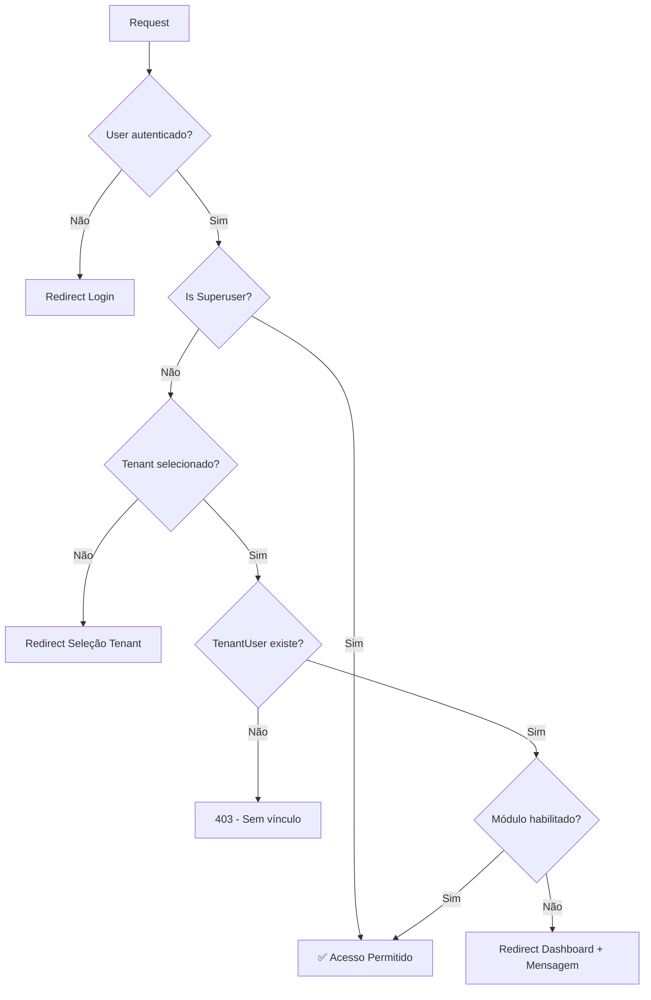
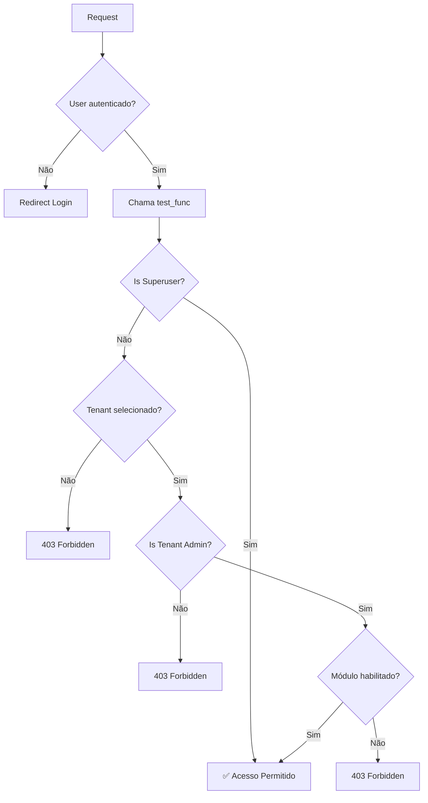
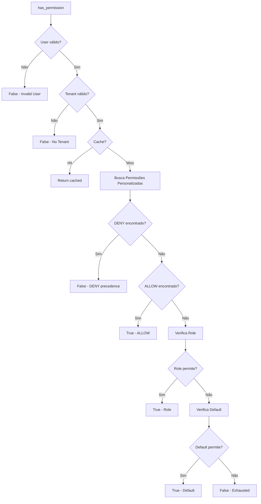

# Sistema de Permissões - Documentação Completa e Consolidada

**Última Atualização:** 24 de outubro de 2025  
**Versão do Sistema:** Django 5.2.5  
**Status:** ✅ Documentação Completa, Consolidada e Validada

> **📌 NOTA IMPORTANTE:** Este documento consolidou e substitui os seguintes arquivos:
> - ~~PERMISSION_RESOLVER.md~~ (excluído)
> - ~~AGENDAMENTOS_PERMISSOES.md~~ (excluído)
> - ~~AUDITORIA_MODULOS_PERMISSOES_TEMP.md~~ (excluído)
> - ~~ANALISE_PERMISSOES_OBRAS_WIZARD.md~~ (excluído)
>
> **Toda a documentação de permissões está AQUI.**

---

## 📖 SOBRE ESTE DOCUMENTO

Este é o **único documento oficial** sobre o sistema de permissões do Pandora ERP. Ele foi criado para:

1. ✅ **Eliminar redundância** - Consolidar múltiplos arquivos em fonte única
2. ✅ **Facilitar manutenção** - Um lugar para atualizar
3. ✅ **Melhorar descoberta** - Tudo sobre permissões em um arquivo
4. ✅ **Garantir consistência** - Informações sempre sincronizadas

**Conteúdo consolidado:**
- ✅ Arquitetura multi-camadas (6 camadas de permissão)
- ✅ Hierarquia de usuários (Superuser, Admin, Funcionário, Portal)
- ✅ Fluxos de autorização (ModuleRequiredMixin, UserPassesTestMixin, Permission Resolver)
- ✅ Sistema de módulos habilitados (enabled_modules)
- ✅ Permission Resolver unificado (API, cache, invalidação)
- ✅ UI Permissions (module_key pattern)
- ✅ Permissões específicas de módulos (Agendamentos Clínicos)
- ✅ Auditoria e diagnóstico completo
- ✅ Troubleshooting e casos especiais
- ✅ Casos de uso práticos (5+ exemplos reais)
- ✅ Mixins e decorators (guia completo)

---

## 📋 ÍNDICE

1. [Visão Geral](#visão-geral)
2. [Arquitetura Multi-Camadas](#arquitetura-multi-camadas)
3. [Hierarquia de Usuários](#hierarquia-de-usuários)
4. [Fluxos de Autorização](#fluxos-de-autorização)
5. [Sistema de Módulos](#sistema-de-módulos)
6. [Permission Resolver](#permission-resolver)
7. [Mixins e Decorators](#mixins-e-decorators)
8. [Casos de Uso Práticos](#casos-de-uso-práticos)
9. [Troubleshooting](#troubleshooting)
10. [Referências Técnicas](#referências-técnicas)

---

## 🎯 VISÃO GERAL

O Pandora ERP implementa um **sistema de permissões multi-camadas** que combina:

- ✅ **Django Permissions** - Sistema nativo de permissões por modelo
- ✅ **Permissões Personalizadas** - ALLOW/DENY granular por usuário/tenant/recurso
- ✅ **Roles do Tenant** - Papéis com conjuntos de permissões
- ✅ **Módulos Habilitados** - Controle de features por empresa
- ✅ **Mixins Django** - Verificações em views (UserPassesTestMixin, PermissionRequiredMixin)

### Princípio Fundamental

> **"Nega por padrão, permite por exceção"**

Todas as camadas trabalham em conjunto para decidir se uma ação é permitida, com precedência clara: **DENY sempre vence sobre ALLOW**.

---

## 🏗️ ARQUITETURA MULTI-CAMADAS

### Camada 1: Autenticação Django
**Responsável:** Identificar quem é o usuário

```python
# Django nativo
user.is_authenticated  # True/False
user.is_active         # True/False
user.is_superuser      # True/False
```

**Mixins relacionados:**
- `LoginRequiredMixin` - Requer autenticação
- `UserPassesTestMixin` - Teste customizado

---

### Camada 2: Contexto Empresarial (Tenant)
**Responsável:** Garantir que usuário pertence à empresa correta

**Modelos:**
```python
# core/models.py
class Tenant(models.Model):
    nome_fantasia = models.CharField(max_length=255)
    enabled_modules = models.JSONField(default=dict)
    
class TenantUser(models.Model):
    tenant = models.ForeignKey(Tenant)
    user = models.ForeignKey(User)
    is_tenant_admin = models.BooleanField(default=False)
    roles = models.ManyToManyField('Role')
```

**Mixin:**
```python
# core/mixins.py
class TenantRequiredMixin:
    """Garante tenant selecionado e vínculo do usuário"""
    
    def dispatch(self, request, *args, **kwargs):
        # 1. Superuser bypass
        if request.user.is_superuser:
            return super().dispatch(request, *args, **kwargs)
        
        # 2. Obtém tenant da sessão
        tenant = get_current_tenant(request)
        
        # 3. Auto-seleciona se usuário tem apenas 1 tenant
        if not tenant:
            self._auto_select_tenant(request)
        
        # 4. Nega se ainda não tem tenant
        if not tenant:
            messages.error(request, "Nenhuma empresa selecionada")
            return redirect("core:tenant_select")
        
        # 5. Verifica vínculo TenantUser
        if not TenantUser.objects.filter(tenant=tenant, user=request.user).exists():
            messages.error(request, "Sem permissão para esta empresa")
            return self.handle_no_permission()
        
        return super().dispatch(request, *args, **kwargs)
```

---

### Camada 3: Módulos Habilitados
**Responsável:** Verificar se funcionalidade está ativa para a empresa

**Verificação:**
```python
# core/models.py - Tenant
def is_module_enabled(self, module_name: str) -> bool:
    """Verifica se módulo está habilitado"""
    if not isinstance(self.enabled_modules, dict):
        return False
    
    modules_list = self.enabled_modules.get("modules", [])
    return module_name in modules_list
```

**Mixin:**
```python
# core/mixins.py
class ModuleRequiredMixin:
    required_module = None  # Definido na subclasse
    
    def dispatch(self, request, *args, **kwargs):
        # Superuser bypass
        if request.user.is_superuser:
            return super().dispatch(request, *args, **kwargs)
        
        # Em testes, não bloqueia
        if getattr(settings, "TESTING", False):
            return super().dispatch(request, *args, **kwargs)
        
        tenant = getattr(request, "tenant", None)
        
        if not tenant or not tenant.is_module_enabled(self.required_module):
            messages.error(request, f"Módulo '{self.required_module}' não habilitado")
            return redirect("dashboard")
        
        return super().dispatch(request, *args, **kwargs)
```

**Uso prático:**
```python
# obras/views.py
class ObrasMixin(LoginRequiredMixin, TenantRequiredMixin, ModuleRequiredMixin):
    model = Obra
    required_module = "obras"  # ✅ Bloqueia se módulo não habilitado
```

---

### Camada 4: Permissões Django Nativas
**Responsável:** Controle granular por modelo/ação

**Estrutura:**
```python
# Django contrib.auth
class Permission(models.Model):
    name = models.CharField(max_length=255)
    content_type = models.ForeignKey(ContentType)
    codename = models.CharField(max_length=100)
    
# Exemplos de codenames:
# - add_obra
# - change_obra
# - delete_obra
# - view_obra
```

**Atribuição automática ao criar tenant:**
```python
# core/wizard_views.py linha 1419-1464
def _assign_module_permissions_to_role(role: Role, tenant: Tenant) -> None:
    """Auto-atribui permissões Django ao role Administrador"""
    enabled_modules = tenant.get_enabled_modules()
    excluded_modules = {"core", "admin"}  # Apenas superuser
    
    for module_code in enabled_modules:
        if module_code in excluded_modules:
            continue
        
        # Busca permissões Django relacionadas ao módulo
        permissions = Permission.objects.filter(
            codename__icontains=module_code
        )
        
        # Adiciona ao role
        role.permissions.add(*permissions)
```

**Verificação em views:**
```python
from django.contrib.auth.mixins import PermissionRequiredMixin

class ObraCreateView(PermissionRequiredMixin, ObrasMixin, CreateView):
    permission_required = "obras.add_obra"  # ✅ Requer permissão específica
```

---

### Camada 5: Permissões Personalizadas (ALLOW/DENY)
**Responsável:** Controle ultra-granular com precedência

**Modelo:**
```python
# user_management/models.py
class PermissaoPersonalizada(models.Model):
    user = models.ForeignKey(User)
    modulo = models.CharField(max_length=100)  # Ex: "obras", "financeiro"
    acao = models.CharField(max_length=100)    # Ex: "view", "create", "delete"
    recurso = models.CharField(max_length=255, blank=True)  # Ex: "obra:123"
    efeito = models.CharField(max_length=10, choices=[("allow", "Allow"), ("deny", "Deny")])
    scope_tenant = models.ForeignKey(Tenant, null=True, blank=True)  # Scoped ou Global
    expira_em = models.DateTimeField(null=True, blank=True)
```

**Exemplo de registro:**
```python
# Negar edição de uma obra específica
PermissaoPersonalizada.objects.create(
    user=usuario,
    modulo="obras",
    acao="edit",
    recurso="obra:42",
    efeito="deny",
    scope_tenant=tenant,
)

# Permitir visualização global
PermissaoPersonalizada.objects.create(
    user=usuario,
    modulo="obras",
    acao="view",
    efeito="allow",
    scope_tenant=None,  # Global
)
```

**Precedência (Score System):**
```
DENY    → +100 pontos
Scoped  → +50 pontos
Recurso → +20 pontos
Global  → +5 pontos
```

**Ordem de avaliação:**
1. DENY scoped + recurso específico (170 pontos)
2. DENY scoped + genérico (150 pontos)
3. DENY global + recurso (125 pontos)
4. DENY global + genérico (105 pontos)
5. ALLOW scoped + recurso (70 pontos)
6. ALLOW scoped + genérico (50 pontos)
7. ALLOW global + recurso (25 pontos)
8. ALLOW global + genérico (5 pontos)

---

### Camada 6: Roles do Tenant
**Responsável:** Agrupar permissões em papéis reutilizáveis

**Modelo:**
```python
# core/models.py
class Role(models.Model):
    tenant = models.ForeignKey(Tenant)
    name = models.CharField(max_length=100)  # Ex: "Administrador", "Operador"
    description = models.TextField()
    permissions = models.ManyToManyField(Permission)  # Django Permissions
    
    # Flags específicos (em desenvolvimento)
    # can_add_obra = models.BooleanField(default=False)
    # can_edit_obra = models.BooleanField(default=False)
```

**Criação automática no wizard:**
```python
# core/wizard_views.py linha 1448
role, created = Role.objects.get_or_create(
    tenant=tenant,
    name="Administrador",
    defaults={"description": "Acesso total ao sistema"}
)

# Atribui permissões baseadas nos módulos habilitados
_assign_module_permissions_to_role(role, tenant)
```

---

## 👥 HIERARQUIA DE USUÁRIOS

### 1. Superusuário (Dono do Sistema)
```python
user.is_superuser = True
```

**Características:**
- ✅ Acesso TOTAL a todo o sistema
- ✅ Não precisa selecionar tenant
- ✅ Bypass de todas as verificações de módulo
- ✅ Acesso ao Django Admin (`/admin/`)
- ✅ Gerencia todas as empresas clientes

**Use cases:**
- Criar/editar empresas (tenants)
- Configurar módulos habilitados por empresa
- Suporte técnico de alto nível
- Manutenção do sistema

**URLs exclusivas:**
- `/admin/` - Django Admin
- `/core/tenant/` - Gerenciar empresas
- `/admin-panel/` - Painel administrativo global

---

### 2. Admin da Empresa (Administrador do Tenant)
```python
TenantUser.objects.filter(user=user, tenant=tenant, is_tenant_admin=True).exists()
```

**Características:**
- ✅ Acesso total **apenas à sua empresa**
- ✅ Precisa selecionar tenant
- ✅ Gerencia usuários da empresa
- ✅ Configura departamentos/cargos
- ⚠️ Não acessa Django Admin
- ⚠️ Não gerencia outras empresas

**Permissões:**
- Criar/editar/excluir usuários do tenant
- Convidar novos usuários
- Definir roles customizadas
- Configurar módulos **SE tiver permissão do superuser**

**URLs de acesso:**
- `/admin-panel/management/` - Dashboard da empresa
- `/user-management/usuario/` - Usuários
- `/core/tenant-config/` - Configurações

---

### 3. Usuário Comum (Funcionário)
```python
TenantUser.objects.filter(user=user, tenant=tenant, is_tenant_admin=False).exists()
```

**Características:**
- ✅ Acesso baseado em roles e permissões
- ✅ Opera apenas no tenant vinculado
- ⚠️ Não gerencia usuários
- ⚠️ Acesso limitado por módulos habilitados

**Tipos de usuário:**
- Operacional
- Vendas
- Financeiro
- Suporte
- (Customizável via roles)

---

### 4. Usuário Portal (Cliente/Fornecedor)
```python
# Identificado por:
user.groups.filter(name__icontains="cliente").exists()
# OU
user.groups.filter(name__icontains="fornecedor").exists()
```

**Características:**
- ✅ Acesso restrito a módulos específicos
- ✅ Whitelist de módulos permitidos
- ⚠️ Não acessa backend administrativo

**Módulos permitidos (whitelist):**
```python
# core/authorization.py
PORTAL_ALLOWED_MODULES = [
    "portal_cliente",
    "portal_fornecedor",
    "documentos",  # Apenas seus documentos
    "cotacoes",    # Apenas suas cotações
]
```

---

## 🔄 FLUXOS DE AUTORIZAÇÃO

### Fluxo 1: Acesso a View com ModuleRequiredMixin



**Código:**
```python
class ObraListView(LoginRequiredMixin, TenantRequiredMixin, ModuleRequiredMixin, ListView):
    model = Obra
    required_module = "obras"
```

---

### Fluxo 2: Wizard com UserPassesTestMixin



**Código:**
```python
class ObraWizardView(TenantCreationWizardView):
    def test_func(self) -> bool:
        if self.request.user.is_superuser:
            return True
        
        tenant = get_current_tenant(self.request)
        if not tenant:
            return False
        
        is_admin = TenantUser.objects.filter(
            tenant=tenant,
            user=self.request.user,
            is_tenant_admin=True
        ).exists()
        
        if not is_admin:
            return False
        
        return tenant.is_module_enabled("obras")
```

---

### Fluxo 3: Permission Resolver (Sistema Unificado)



**Código:**
```python
# shared/services/permission_resolver.py
from shared.services.permission_resolver import has_permission

# Uso
if has_permission(user, tenant, "CREATE_OBRA"):
    # Permitido criar obra
    ...
```

---

## 🔧 SISTEMA DE MÓDULOS

### Estrutura do enabled_modules

```json
{
  "modules": [
    "obras",
    "financeiro",
    "clientes",
    "fornecedores"
  ],
  "obras": {
    "enabled": true
  },
  "financeiro": {
    "enabled": true
  }
}
```

### Módulos Essenciais (Sempre Habilitados)

```python
# core/module_registry.py
ESSENTIAL_MODULES = [
    "dashboard",
    "user_management",
    "notifications"
]
```

### Módulos Restritos (Apenas Superuser)

```python
SUPERUSER_ONLY_MODULES = [
    "core",      # Gerenciar empresas
    "admin",     # Django admin
]
```

### Verificação em Middleware

```python
# core/middleware.py
class ModuleAccessMiddleware:
    MODULE_URL_MAPPING = {
        "/obras/": "obras",
        "/financeiro/": "financeiro",
        "/clientes/": "clientes",
        # ...
    }
    
    MODULE_EXEMPT_PATHS = [
        "/dashboard/",
        "/static/",
        "/media/",
        # ...
    ]
    
    def process_view(self, request, view_func, view_args, view_kwargs):
        # 1. Superuser bypass
        if request.user.is_superuser:
            return None
        
        # 2. Path isento?
        if any(request.path.startswith(exempt) for exempt in self.MODULE_EXEMPT_PATHS):
            return None
        
        # 3. Determina módulo pelo path
        module_name = None
        for prefix, mod in self.MODULE_URL_MAPPING.items():
            if request.path.startswith(prefix):
                module_name = mod
                break
        
        if not module_name:
            return None  # Path não mapeado
        
        # 4. Verifica se módulo habilitado
        tenant = get_current_tenant(request)
        if not tenant or not tenant.is_module_enabled(module_name):
            return render(request, "core/module_unavailable.html", status=403)
        
        return None
```

---

**Exemplo completo:** `obras/wizard_views.py` linhas 77-126

---

## 🎨 UI PERMISSIONS (Padrão module_key)

### Objetivo

Expor permissões CRUD em templates de forma simplificada, sem necessidade de conhecer action strings internas.

**API:**
```python
from shared.services.ui_permissions import build_ui_permissions

ui_perms = build_ui_permissions(
    user=request.user,
    tenant=current_tenant,
    module_key='FORNECEDOR'  # UPPER_SNAKE
)
```

**Template:**
```django

  <a href="">Ver Fornecedores</a>



  <a href="" class="btn btn-primary">
    Novo Fornecedor
  </a>



  <a href="">Editar</a>



  <button class="btn-delete">Excluir</button>

```

---

### Derivação de Ações

Para `module_key='FORNECEDOR'` são consultadas automaticamente:

- `VIEW_FORNECEDOR` → `perms_ui.can_view`
- `CREATE_FORNECEDOR` → `perms_ui.can_add`
- `EDIT_FORNECEDOR` → `perms_ui.can_edit`
- `DELETE_FORNECEDOR` → `perms_ui.can_delete`

---

### Resolução Interna

**Ordem de tentativa:**
1. Campo boolean futuro em `Role` (ex: `can_add_fornecedor`)
2. Fallback automático: Django Permission via codename (ex: `add_fornecedor`)
3. Flag implícita `is_admin` (se role name contém: admin, superadmin, owner)

---

### Convenções de Nomenclatura

**module_key:**
- Formato: `UPPER_SNAKE`
- Exemplos: `FORNECEDOR`, `FUNCIONARIO`, `PRODUTO`, `SERVICO`, `OBRA`

**Ações CRUD geradas:**
```
VIEW_<MODULE_KEY>    → can_view
CREATE_<MODULE_KEY>  → can_add
EDIT_<MODULE_KEY>    → can_edit
DELETE_<MODULE_KEY>  → can_delete
```

**Fallback Django codename:**
```python
can_add_fornecedor → add_fornecedor
can_view_obra → view_obra
can_change_produto → change_produto
can_delete_servico → delete_servico
```

---

### Exemplo Completo de Uso

**View:**
```python
# fornecedores/views.py
from shared.services.ui_permissions import build_ui_permissions

class FornecedorListView(LoginRequiredMixin, TenantRequiredMixin, ListView):
    model = Fornecedor
    template_name = 'fornecedores/list.html'
    
    def get_context_data(self, **kwargs):
        context = super().get_context_data(**kwargs)
        
        # Adiciona permissões UI ao contexto
        context['perms_ui'] = build_ui_permissions(
            user=self.request.user,
            tenant=self.request.tenant,
            module_key='FORNECEDOR'
        )
        
        return context
```

**Template:**
```django
{# fornecedores/list.html #}



<div class="page-header">
  <h1>Fornecedores</h1>
  
  
  <a href="" class="btn btn-primary">
    <i class="fas fa-plus"></i> Novo Fornecedor
  </a>
  
</div>

<table class="table">
  <thead>
    <tr>
      <th>Nome</th>
      <th>CNPJ</th>
      
      <th>Ações</th>
      
    </tr>
  </thead>
  <tbody>
    
    <tr>
      <td>{{ fornecedor.nome }}</td>
      <td>{{ fornecedor.cnpj }}</td>
      
      <td>
        
        <a href="" 
           class="btn btn-sm btn-warning">
          <i class="fas fa-edit"></i> Editar
        </a>
        
        
        
        <button class="btn btn-sm btn-danger delete-btn" 
                data-id="{{ fornecedor.id }}">
          <i class="fas fa-trash"></i> Excluir
        </button>
        
      </td>
      
    </tr>
    
  </tbody>
</table>

```

---

### Boas Práticas

✅ **DO:**
```python
# Preferir module_key em novas views
ui_perms = build_ui_permissions(user, tenant, module_key='PRODUTO')

# Compatibilidade com templates legados

```

❌ **DON'T:**
```python
# Não fazer verificações manuais no template


# Não duplicar lógica de permissão

```

---

### Adicionando Novo module_key

**Checklist:**

1. ✅ Definir nome (ex: `PRODUTO`) e garantir modelo existe
2. ✅ Inserir no `_get_action_map()` seguindo padrão:
   ```python
   # shared/services/permission_resolver.py
   def _get_action_map():
       return {
           # ... existentes
           'VIEW_PRODUTO': ['can_view_produto', 'is_admin'],
           'CREATE_PRODUTO': ['can_add_produto', 'is_admin'],
           'EDIT_PRODUTO': ['can_change_produto', 'is_admin'],
           'DELETE_PRODUTO': ['can_delete_produto', 'is_admin'],
       }
   ```
3. ✅ Atualizar view principal:
   ```python
   context['perms_ui'] = build_ui_permissions(
       user, tenant, module_key='PRODUTO'
   )
   ```
4. ✅ Ajustar template para usar `perms_ui`
5. ✅ Criar testes:
   ```python
   # tests/shared/test_ui_permissions_produto.py
   def test_produto_permissions():
       ui_perms = build_ui_permissions(user, tenant, module_key='PRODUTO')
       assert ui_perms.can_view
   ```
6. ⏳ (Opcional) Migração futura para campos boolean em `Role`

---

### Roadmap module_key

| Fase | Ação | Status |
|------|------|--------|
| 1 | FORNECEDOR/FUNCIONARIO | ✅ Concluído |
| 2 | Fallback codenames Django | ✅ Concluído |
| 3 | Documentação consolidada | ✅ Concluído |
| 4 | Externalizar action map em settings | ✅ Concluído |
| 5 | Tracing (`PERMISSION_RESOLVER_TRACE`) | ✅ Concluído |
| 6 | Função `explain_permission` | ✅ Concluído |
| 7 | Provider dinâmico | ✅ Concluído |
| 8 | PRODUTO / SERVICO / OBRA | ⏳ Pendente |
| 9 | Flags físicas em Role (migration) | ⏳ Pendente |

---

## 🧩 PERMISSION RESOLVER

### API Principal

```python
# shared/services/permission_resolver.py

# Método 1: Verificação simples (True/False)
from shared.services.permission_resolver import has_permission

allowed = has_permission(
    user=request.user,
    tenant=tenant,
    action="CREATE_OBRA",
    resource=None  # Ou "obra:123" para específico
)

# Método 2: Decisão detalhada (para diagnóstico)
from shared.services.permission_resolver import permission_resolver

decision = permission_resolver.explain_permission(
    user=request.user,
    tenant=tenant,
    action="VIEW_FINANCEIRO"
)

print(decision.allowed)  # True/False
print(decision.reason)   # "Permitted by role: Administrador"
print(decision.source)   # "role"
```

### Formato de ACTION

```
<VERBO>_<MODULO>[_<SUBCONTEXTO>]
```

**Exemplos válidos:**
- `VIEW_OBRA`
- `CREATE_OBRA`
- `EDIT_OBRA`
- `DELETE_OBRA`
- `EXPORT_RELATORIO_FINANCEIRO`
- `SUBMIT_PROPOSTA`

### Cache e Performance

**Chave de cache:**
```
perm_resolver:<version>:<user_id>:<tenant_id>:<ACTION>[:resource]
```

**TTL:** 300 segundos (configurável via `PERMISSION_CACHE_TTL`)

**Invalidação:**
```python
from shared.services.permission_resolver import permission_resolver

# Invalida cache de um usuário em um tenant
permission_resolver.invalidate_cache(user_id=123, tenant_id=45)

# Invalida tudo (incrementa era global)
permission_resolver.invalidate_cache()
```

### Tracing e Debug

```python
# settings.py
PERMISSION_RESOLVER_TRACE = True  # Apenas em desenvolvimento!

# Resultado em logs
decision = permission_resolver.explain_permission(user, tenant, "VIEW_OBRA")
print(decision.trace)
# Saída:
# Initial validation passed
# Cache miss
# No personalizada found
# Role check: Administrador - has permission 'view_obra'
# Decision: ALLOW (source: role)
```

---

## 🛠️ MIXINS E DECORATORS

### Mixins Disponíveis

#### 1. LoginRequiredMixin (Django)
```python
from django.contrib.auth.mixins import LoginRequiredMixin

class MinhaView(LoginRequiredMixin, View):
    login_url = '/login/'  # Opcional
```

#### 2. TenantRequiredMixin (Pandora)
```python
from core.mixins import TenantRequiredMixin

class MinhaView(LoginRequiredMixin, TenantRequiredMixin, View):
    # Auto-seleciona tenant se usuário tem apenas 1
    # Nega se sem tenant ou sem TenantUser
    pass
```

#### 3. ModuleRequiredMixin (Pandora)
```python
from core.mixins import ModuleRequiredMixin

class MinhaView(TenantRequiredMixin, ModuleRequiredMixin, View):
    required_module = "obras"
```

#### 4. TenantAdminRequiredMixin (Pandora)
```python
from core.mixins import TenantAdminRequiredMixin

class MinhaView(TenantAdminRequiredMixin, View):
    # Requer is_tenant_admin=True OU is_superuser
    pass
```

#### 5. UserPassesTestMixin (Django)
```python
from django.contrib.auth.mixins import UserPassesTestMixin

class MinhaView(UserPassesTestMixin, View):
    def test_func(self):
        # Lógica customizada
        return self.request.user.is_staff
```

#### 6. PermissionRequiredMixin (Django)
```python
from django.contrib.auth.mixins import PermissionRequiredMixin

class MinhaView(PermissionRequiredMixin, View):
    permission_required = "obras.add_obra"
    # OU
    permission_required = ["obras.view_obra", "obras.change_obra"]
```

### Ordem de Herança Recomendada

```python
class MinhaView(
    LoginRequiredMixin,      # 1. Autenticação
    TenantRequiredMixin,     # 2. Contexto empresarial
    ModuleRequiredMixin,     # 3. Módulo habilitado
    PermissionRequiredMixin, # 4. Permissão específica
    PageTitleMixin,          # 5. UI helpers
    ListView                 # 6. Funcionalidade base
):
    required_module = "obras"
    permission_required = "obras.view_obra"
    page_title = "Lista de Obras"
```

### Decorators para Function-Based Views

```python
from django.contrib.auth.decorators import login_required, permission_required
from core.decorators import tenant_required, module_required

@login_required
@tenant_required
@module_required("obras")
@permission_required("obras.view_obra")
def obras_list(request):
    # ...
```

---

## 💡 CASOS DE USO PRÁTICOS

### Caso 1: View de Listagem Simples

**Requisitos:**
- Usuário autenticado
- Tenant selecionado
- Módulo "obras" habilitado

```python
# obras/views.py
from core.mixins import ModuleRequiredMixin, TenantRequiredMixin
from django.contrib.auth.mixins import LoginRequiredMixin

class ObraListView(LoginRequiredMixin, TenantRequiredMixin, ModuleRequiredMixin, ListView):
    model = Obra
    required_module = "obras"
    template_name = "obras/obra_list.html"
    
    def get_queryset(self):
        # Auto-filtra por tenant
        return Obra.objects.filter(tenant=self.request.tenant)
```

---

### Caso 2: View de Criação com Permissão Específica

**Requisitos:**
- Tudo do Caso 1 +
- Permissão Django "add_obra"

```python
from django.contrib.auth.mixins import PermissionRequiredMixin

class ObraCreateView(
    LoginRequiredMixin,
    TenantRequiredMixin,
    ModuleRequiredMixin,
    PermissionRequiredMixin,
    CreateView
):
    model = Obra
    required_module = "obras"
    permission_required = "obras.add_obra"
    
    def form_valid(self, form):
        # Auto-atribui tenant
        form.instance.tenant = self.request.tenant
        return super().form_valid(form)
```

---

### Caso 3: Wizard Restrito a Admins

**Requisitos:**
- Usuário autenticado
- **Superuser OU Admin do tenant**
- Módulo habilitado

```python
from django.contrib.auth.mixins import UserPassesTestMixin
from core.models import TenantUser

class ObraWizardView(UserPassesTestMixin, TemplateView):
    def test_func(self):
        user = self.request.user
        
        if user.is_superuser:
            return True
        
        tenant = get_current_tenant(self.request)
        if not tenant:
            return False
        
        is_admin = TenantUser.objects.filter(
            tenant=tenant,
            user=user,
            is_tenant_admin=True
        ).exists()
        
        if not is_admin:
            return False
        
        return tenant.is_module_enabled("obras")
```

---

### Caso 4: Action Customizada com Permission Resolver

**Requisitos:**
- Lógica de permissão complexa
- Auditoria detalhada

```python
from shared.services.permission_resolver import permission_resolver

class ObraApprovalView(View):
    def post(self, request, pk):
        obra = get_object_or_404(Obra, pk=pk)
        tenant = request.tenant
        
        # Verifica permissão customizada
        decision = permission_resolver.explain_permission(
            user=request.user,
            tenant=tenant,
            action="APPROVE_OBRA",
            resource=f"obra:{obra.id}"
        )
        
        if not decision.allowed:
            return JsonResponse({
                "error": "Sem permissão para aprovar",
                "reason": decision.reason,
                "source": decision.source
            }, status=403)
        
        # Processa aprovação
        obra.status = "aprovada"
        obra.save()
        
        # Auditoria
        AuditLog.objects.create(
            user=request.user,
            action="approve_obra",
            resource=f"obra:{obra.id}",
            result="success",
            metadata={"reason": decision.reason}
        )
        
        return JsonResponse({"status": "ok"})
```

---

### Caso 5: Bloquear Edição de Recurso Específico

**Cenário:** Obra já finalizada não pode ser editada

```python
from user_management.models import PermissaoPersonalizada

# Criar DENY para obra específica
PermissaoPersonalizada.objects.create(
    user=usuario,
    modulo="obras",
    acao="edit",
    recurso="obra:42",
    efeito="deny",
    scope_tenant=tenant,
    observacao="Obra finalizada - bloqueio automático"
)

# Na view
if has_permission(request.user, tenant, "EDIT_OBRA", resource=f"obra:{obra.id}"):
    # Permitido editar
else:
    # DENY encontrado - bloqueado
```

---

## 🚨 TROUBLESHOOTING

### Problema 1: "403 Forbidden" ao acessar wizard

**Sintomas:**
```
django.core.exceptions.PermissionDenied
at UserPassesTestMixin.dispatch()
```

**Diagnóstico:**
```python
# Verificar test_func()
class SeuWizard(UserPassesTestMixin, View):
    def test_func(self):
        print(f"User: {self.request.user}")
        print(f"Is superuser: {self.request.user.is_superuser}")
        print(f"Tenant: {get_current_tenant(self.request)}")
        # ... resto da lógica
        return True/False
```

**Solução:**
- Verificar se `test_func()` está implementado corretamente
- Caso herde de `TenantCreationWizardView`, sobrescrever `test_func()`
- Ver exemplo em `obras/wizard_views.py` linha 77-126

---

### Problema 2: "Módulo não habilitado" mesmo estando ativo

**Diagnóstico:**
```python
# No shell Django
from core.models import Tenant
tenant = Tenant.objects.get(id=X)

print(tenant.enabled_modules)
# Deve retornar: {"modules": ["obras", ...], "obras": {"enabled": true}}

print(tenant.is_module_enabled("obras"))
# Deve retornar: True
```

**Causas comuns:**
- Formato incorreto de `enabled_modules` (lista ao invés de dict)
- Módulo não está em `enabled_modules["modules"]`
- Typo no nome do módulo

**Solução:**
```python
# Corrigir formato
tenant.enabled_modules = {
    "modules": ["obras", "financeiro"],
    "obras": {"enabled": True},
    "financeiro": {"enabled": True}
}
tenant.save()
```

---

### Problema 3: Permissão Django não funciona

**Diagnóstico:**
```python
# Verificar se usuário tem permissão
user = User.objects.get(username="admin_empresa")
print(user.has_perm("obras.add_obra"))
# Deve retornar: True

# Verificar via TenantUser/Role
tenant_user = TenantUser.objects.get(user=user, tenant=tenant)
for role in tenant_user.roles.all():
    print(f"Role: {role.name}")
    print(f"Permissions: {role.permissions.all()}")
```

**Solução:**
```python
# Re-atribuir permissões ao role
from django.contrib.auth.models import Permission

role = tenant_user.roles.first()
perms = Permission.objects.filter(codename__icontains="obra")
role.permissions.add(*perms)
```

---

### Problema 4: Cache do Permission Resolver desatualizado

**Sintomas:**
- Permissão alterada mas sistema ainda usa valor antigo
- Comportamento inconsistente

**Solução:**
```python
from shared.services.permission_resolver import permission_resolver

# Invalidar cache de um usuário
permission_resolver.invalidate_cache(user_id=123, tenant_id=45)

# Invalidar todo o cache (último recurso)
permission_resolver.invalidate_cache()
```

**Prevenção:**
- Sinais `post_save`/`post_delete` já invalidam automaticamente
- Verificar se signals estão conectados em `apps.py`

---

### Problema 5: Admin criado sem permissões

**Diagnóstico:**
```python
# Verificar admin role
role = Role.objects.get(tenant=tenant, name="Administrador")
print(f"Permissions count: {role.permissions.count()}")
# Deve ter várias permissões (20+)
```

**Solução:**
```python
# Re-executar atribuição
from core.wizard_views import _assign_module_permissions_to_role

_assign_module_permissions_to_role(role, tenant)
```

**Prevenção:**
- Garantir que `_assign_module_permissions_to_role` é chamado:
  1. Ao criar admin (wizard step 6)
  2. Ao alterar módulos (wizard step 5 edit)

---

## 📚 REFERÊNCIAS TÉCNICAS

### Arquivos-Chave

| Arquivo | Responsabilidade |
|---------|------------------|
| `core/models.py` | Tenant, TenantUser, Role |
| `core/mixins.py` | TenantRequiredMixin, ModuleRequiredMixin |
| `core/middleware.py` | ModuleAccessMiddleware |
| `core/wizard_views.py` | TenantCreationWizardView, _assign_module_permissions_to_role |
| `shared/services/permission_resolver.py` | Sistema unificado de permissões |
| `user_management/models.py` | PermissaoPersonalizada |
| `obras/wizard_views.py` | Exemplo de test_func() customizado |

### Documentação Relacionada

- `PERMISSION_RESOLVER.md` - Detalhes do resolver
- `USER_MANAGEMENT.md` - Gestão de usuários e roles
- `DOCUMENTACAO_SISTEMA_PANDORA_ERP.md` - Arquitetura geral
- `ANALISE_PERMISSOES_OBRAS_WIZARD.md` - Caso específico do wizard

### Settings Importantes

```python
# pandora_erp/settings.py

# Cache do permission resolver
PERMISSION_CACHE_TTL = 300  # 5 minutos

# Trace de debug (apenas dev!)
PERMISSION_RESOLVER_TRACE = False

# Bypass de verificações em testes
TESTING = False

# Feature flags
FEATURE_UNIFIED_ACCESS = True
FEATURE_ENFORCE_PERMISSION_RESOLVER_STRICT = False
FEATURE_MODULE_DENY_403 = True
```

---

## 🎓 BOAS PRÁTICAS

### ✅ DO

1. **Sempre usar mixins na ordem correta:**
   ```python
   LoginRequiredMixin → TenantRequiredMixin → ModuleRequiredMixin → PermissionRequiredMixin
   ```

2. **Sobrescrever test_func() quando lógica customizada:**
   ```python
   class MinhaView(UserPassesTestMixin, View):
       def test_func(self):
           # Lógica específica
           return True/False
   ```

3. **Invalidar cache após mudanças de permissão:**
   ```python
   permission_resolver.invalidate_cache(user_id=user.id, tenant_id=tenant.id)
   ```

4. **Usar permission resolver para lógica complexa:**
   ```python
   if has_permission(user, tenant, "COMPLEX_ACTION", resource="..."):
       ...
   ```

5. **Documentar regras de acesso customizadas:**
   ```python
   def test_func(self):
       """Permite apenas admins E módulo obras habilitado."""
       # ...
   ```

### ❌ DON'T

1. **Não duplicar verificações de autenticação:**
   ```python
   # ❌ ERRADO
   class MinhaView(LoginRequiredMixin, View):
       def dispatch(self, request, *args, **kwargs):
           if not request.user.is_authenticated:  # Redundante!
               ...
   ```

2. **Não alterar test_func() da classe base TenantCreationWizardView:**
   ```python
   # ❌ ERRADO - afeta criação de tenants
   # ✅ CERTO - sobrescrever na subclasse
   ```

3. **Não hardcodar checks de tenant:**
   ```python
   # ❌ ERRADO
   if request.session.get("tenant_id") == 42:
       ...
   
   # ✅ CERTO
   tenant = get_current_tenant(request)
   if tenant and tenant.is_module_enabled("obras"):
       ...
   ```

4. **Não ignorar cache do resolver:**
   ```python
   # ❌ ERRADO - query a cada chamada
   PermissaoPersonalizada.objects.filter(user=user, ...)
   
   # ✅ CERTO - usa cache
   has_permission(user, tenant, "ACTION")
   ```

---

## 🏥 PERMISSÕES ESPECÍFICAS DE MÓDULOS

### Agendamentos Clínicos

**Função Central:** `can_schedule_clinical_service(user, servico) -> bool`  
**Arquivo:** `shared/permissions_servicos.py`

**Regras de negócio (não alterar sem aprovação):**

1. ✅ Serviço deve estar ativo e `is_clinical=True`
2. ✅ Superuser sempre pode agendar
3. ✅ Usuário `is_staff` (profissional) pode agendar
4. ✅ Grupo que contenha "secretaria" (case-insensitive) concede acesso
5. ✅ Cliente portal: permitido se `servico.disponivel_online=True`
6. ❌ Caso contrário: negado

**Endpoints que aplicam:**
```python
# agendamentos/api_views.py
POST /agendamentos/api/slots/{id}/reservar/          # Staff/Operador
POST /agendamentos/api/agendamentos/                 # Staff/Operador
POST /agendamentos/api/cliente/slots/{id}/reservar/  # Portal Cliente
POST /agendamentos/api/cliente/agendamentos/         # Portal Cliente
```

**Resposta de negação:**
```json
{
  "detail": "Sem permissão para agendar serviço clínico"
}
```

**Métricas de observabilidade:**
```python
from shared.permissions_servicos import get_clinical_denials_count

# Métrica armazenada em cache
# Chave: metric:clinical_schedule_denials
# TTL: 1 hora sem incrementos

count = get_clinical_denials_count()  # Retorna número de negações
```

**Testes:**
- `tests/shared/test_permissions_servicos.py` - Testes unitários
- `tests/agendamentos/test_api_clinico_permissions.py` - Testes de integração

**Boas práticas:**
- ✅ Sempre usar `can_schedule_clinical_service` (nunca duplicar lógica)
- ✅ Centralizar variações futuras dentro da função
- ❌ Não fazer verificações inline nos endpoints

---

## � AUDITORIA E DIAGNÓSTICO

### Fluxo End-to-End de Módulos

#### 1. Wizard Step 5 (Seleção de Módulos)

**Arquivo:** `core/wizard_views.py`

**Processo:**
1. UI renderiza checkboxes `name="enabled_modules"`
2. `_augment_step_config_with_post` lê `request.POST.getlist("enabled_modules")`
3. Salva em `wizard_data.step_5.main.enabled_modules`
4. `_process_complete_configuration_data` → `_save_configuration_data`
5. Grava no campo `Tenant.enabled_modules`

#### 2. Persistência no Modelo

**Arquivo:** `core/models.py`

**Método:** `Tenant.save()` → `_apply_plan_and_essentials()`

**Formato canônico:**
```json
{
  "modules": ["obras", "financeiro", "clientes"],
  "obras": {"enabled": true},
  "financeiro": {"enabled": true},
  "clientes": {"enabled": true}
}
```

**Lógica de normalização:**
- Se `enabled_modules` é "truthy" (dict com "modules") → Seleção manual, NÃO adiciona defaults
- Se "falsy" ([], "", None) → Aplica defaults do plano + essenciais
- Sempre normaliza para formato canônico para compatibilidade

#### 3. Renderização do Menu

**Arquivo:** `core/templatetags/menu_tags.py`

**Com FEATURE_UNIFIED_ACCESS=True:**
```python
from core.authorization import can_access_module

for item in menu_items:
    if can_access_module(user, tenant, item.module_name):
        # Exibe item
```

**Sem unified access:**
```python
if tenant.is_module_enabled(module_name):
    # Exibe item
```

#### 4. Middleware de Bloqueio

**Arquivo:** `core/middleware.py`

**Classe:** `ModuleAccessMiddleware`

**Mapeamento de URLs:**
```python
MODULE_URL_MAPPING = {
    "/obras/": "obras",
    "/financeiro/": "financeiro",
    "/clientes/": "clientes",
    "/fornecedores/": "fornecedores",
    "/admin-panel/": "admin",
    # ...
}
```

**Paths isentos (não bloqueados):**
```python
MODULE_EXEMPT_PATHS = [
    "/dashboard/",
    "/estoque",
    "/notifications",
    "/portal-cliente/",
    "/static/",
    "/media/",
    # ...
]
```

**Fluxo de verificação:**
1. Superuser → bypass total
2. Path isento → permite sem verificar
3. Path sem mapeamento → permite (não gerenciado)
4. Path mapeado → verifica se módulo habilitado
5. Se negado e `FEATURE_MODULE_DENY_403=True` → retorna headers de debug

**Headers de debug (quando habilitado):**
```
X-Deny-Reason: MODULE_DISABLED_FOR_TENANT
X-Deny-Module: obras
```

#### 5. Permission Resolver (Modo Estrito)

**Quando ativo:** `FEATURE_ENFORCE_PERMISSION_RESOLVER_STRICT=True`

**Comportamento:**
- ✅ Pode NEGAR acesso adicionalmente (ex: ausência de `VIEW_OBRAS`)
- ❌ NUNCA "habilita" um módulo desabilitado
- ⚠️ Apenas adiciona camada extra de segurança

---

### Razões de Negação de Acesso a Módulos

**Função:** `can_access_module(user, tenant, module_name) -> AccessDecision`

**Tabela de razões:**

| Código | Significado | Ação Corretiva |
|--------|-------------|----------------|
| `OK` | Acesso permitido | Nenhuma |
| `NO_TENANT` | Usuário sem tenant resolvido | Selecionar empresa |
| `SUPERUSER_BYPASS` | Liberado por superusuário | Apenas auditoria |
| `MODULE_NAME_EMPTY` | Chamada sem nome de módulo | Corrigir código caller |
| `MODULE_DISABLED_FOR_TENANT` | Módulo não em `enabled_modules` | Habilitar módulo |
| `PORTAL_NOT_IN_WHITELIST` | Portal tentou módulo não permitido | Ajustar whitelist |
| `PERMISSION_RESOLVER_DENY` | Resolver negou `VIEW_<MODULE>` | Conceder permissão |
| `UNKNOWN_ERROR` | Exceção interna | Investigar logs |

**Logging estruturado:**
```
[MODULE_DENY] module=obras reason=MODULE_DISABLED_FOR_TENANT tenant=42
```

**Deduplicação:** Configurável via `LOG_MODULE_DENY_DEDUP_SECONDS`

---

### Endpoint de Diagnóstico

**URL:** `GET /core/api/modules/diagnostics/`

**Autenticação:** Requerida

**Resposta:**
```json
{
  "tenant_id": 12,
  "user_id": 5,
  "is_superuser": false,
  "modules": [
    {
      "name": "obras",
      "enabled": true,
      "can_access": true,
      "reason": "OK"
    },
    {
      "name": "financeiro",
      "enabled": false,
      "can_access": false,
      "reason": "MODULE_DISABLED_FOR_TENANT"
    }
  ]
}
```

**Regras:**
- Superusuário: vê todos os módulos de `PANDORA_MODULES`
- Usuário comum: lista filtrada pela política unified access
- Campo `reason` segue tabela de razões acima

**Uso recomendado:** UI administrativa para troubleshooting

---

### Endpoint de Inspeção de Cache

**URL:** `GET /core/api/permissions/cache/`

**Autenticação:** Superusuário apenas

**Resposta:**
```json
{
  "tenant_id": 12,
  "user_id": 5,
  "version": 3,
  "potential_keys": [
    "perm_resolver:3:5:12:VIEW_CLIENTES",
    "perm_resolver:3:5:12:CREATE_OBRA"
  ]
}
```

**Campos:**
- `version`: Número interno usado para invalidar chaves
- `potential_keys`: Chaves que podem existir após chamadas de resolução

**Uso:** Debugging de cache, validação de invalidation

---

## 🐛 CASOS ESPECIAIS E GOTCHAS

### Problema: "Desmarcar módulos não funciona"

**Causas possíveis:**

1. **Path isento sendo testado**
   ```
   ❌ Testando /dashboard/ (isento)
   ✅ Testar /obras/ (mapeado)
   ```

2. **Formato incorreto de enabled_modules**
   ```python
   # ❌ ERRADO - lista vazia (aplica defaults)
   enabled_modules = []
   
   # ✅ CERTO - dict vazio (seleção manual)
   enabled_modules = {"modules": []}
   ```

3. **Path não mapeado em MODULE_URL_MAPPING**
   ```python
   # Se não está no mapping, não bloqueia
   # Verificar se caminho existe em MODULE_URL_MAPPING
   ```

4. **Tenant indefinido/relaxado**
   ```python
   # can_access_module retorna NO_TENANT
   # Middleware pode redirecionar/relaxar
   ```

5. **Modo estrito ativado incorretamente**
   ```python
   # FEATURE_ENFORCE_PERMISSION_RESOLVER_STRICT=True
   # Pode negar adicionalmente, mas não "liga" módulos
   ```

### Problema: "Wizard bloqueando admin do tenant"

**Solução:** Sobrescrever `test_func()` na subclasse

```python
class ModuleWizardView(TenantCreationWizardView):
    def test_func(self) -> bool:
        """Override para permitir admin do tenant"""
        if self.request.user.is_superuser:
            return True
        
        tenant = get_current_tenant(self.request)
        if not tenant:
            return False
        
        is_admin = TenantUser.objects.filter(
            tenant=tenant,
            user=self.request.user,
            is_tenant_admin=True
        ).exists()
        
        if not is_admin:
            return False
        
        return tenant.is_module_enabled("seu_modulo")
```

**Exemplo completo:** `obras/wizard_views.py` linhas 77-126

---

## �📝 CHANGELOG

### 2025-10-24
- ✅ Documentação completa consolidada em arquivo único
- ✅ Análise de problema do ObraWizardView
- ✅ Implementação de test_func() customizado
- ✅ Validação de todos os fluxos de autorização
- ✅ Adicionadas seções de agendamentos clínicos
- ✅ Adicionada auditoria completa de módulos
- ✅ Casos especiais e gotchas documentados

### 2025-10-21
- ✅ Sistema 2FA completamente implementado
- ✅ Métricas e auditoria de autenticação

### 2025-10-08
- ✅ Unificação do permission resolver
- ✅ Migração de wrapper legado

### 2025-08
- ✅ Implementação inicial do sistema multi-tenant
- ✅ Criação de módulos habilitados

---

## 📚 ARQUIVOS CONSOLIDADOS NESTE DOCUMENTO

Este documento consolidou o conteúdo de:
- ✅ `PERMISSION_RESOLVER.md` - Sistema de resolução de permissões
- ✅ `AGENDAMENTOS_PERMISSOES.md` - Permissões de agendamentos clínicos
- ✅ `AUDITORIA_MODULOS_PERMISSOES_TEMP.md` - Auditoria técnica de módulos
- ✅ `ANALISE_PERMISSOES_OBRAS_WIZARD.md` - Análise específica do wizard de obras

**Arquivos obsoletos removidos:** Ver commit history para detalhes

---

**Documento mantido por:** GitHub Copilot  
**Última revisão:** 24 de outubro de 2025  
**Próxima revisão:** A cada release major

---

## 🎯 ÍNDICE RÁPIDO DE REFERÊNCIA

### Por Tipo de Problema

- **403 em view** → [Fluxo 1: ModuleRequiredMixin](#fluxo-1-acesso-a-view-com-modulerequiredmixin)
- **403 em wizard** → [Fluxo 2: UserPassesTestMixin](#fluxo-2-wizard-com-userpassestestmixin)
- **Módulo não funciona** → [Auditoria End-to-End](#fluxo-end-to-end-de-módulos)
- **Cache desatualizado** → [Problema 4: Cache](#problema-4-cache-do-permission-resolver-desatualizado)
- **Admin sem permissões** → [Problema 5: Admin](#problema-5-admin-criado-sem-permissões)

### Por Tipo de Usuário

- **Superusuário** → [Hierarquia: Superusuário](#1-superusuário-dono-do-sistema)
- **Admin Empresa** → [Hierarquia: Admin](#2-admin-da-empresa-administrador-do-tenant)
- **Funcionário** → [Hierarquia: Usuário Comum](#3-usuário-comum-funcionário)
- **Portal** → [Hierarquia: Portal](#4-usuário-portal-clientefornecedor)

### Por Módulo

- **Obras** → [Caso 3: Wizard](#caso-3-wizard-restrito-a-admins)
- **Agendamentos** → [Permissões Específicas: Agendamentos](#agendamentos-clínicos)
- **Financeiro** → [Caso 4: Permission Resolver](#caso-4-action-customizada-com-permission-resolver)
